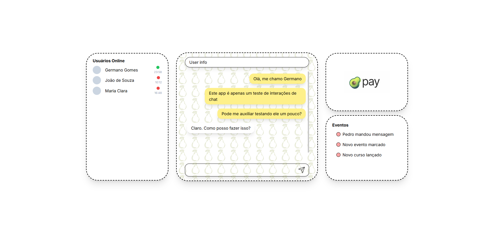

# Pera Chat
Tihs project was made to practice Chat interactions with websockets.

## Screenshots



## Getting Started
First, run the development server:
```bash
npm run dev
# or
yarn dev
# or
pnpm dev
# or
bun dev
```

Open [http://localhost:3000](http://localhost:3000) with your browser to see the result.

## Introducing AbacatePay

[AbacatePay](https://www.abacatepay.com/) is a payment gateway designed to simplify the integration of PIX transactions into your projects. With its clear documentation and intuitive API, AbacatePay enables quick and efficient payment processing, allowing you to focus on developing your application without the complexities of payment system integration. We encourage you to explore AbacatePay and consider contributing to its ongoing development.

### Why am I promoting them?  
Simply because I loved their concept, the tool’s usability, and I want to contribute to its growth.

## Learn More
To learn more about Next.js, take a look at the following resources:

- [Next.js Documentation](https://nextjs.org/docs) - learn about Next.js features and API.
- [Learn Next.js](https://nextjs.org/learn) - an interactive Next.js tutorial.
